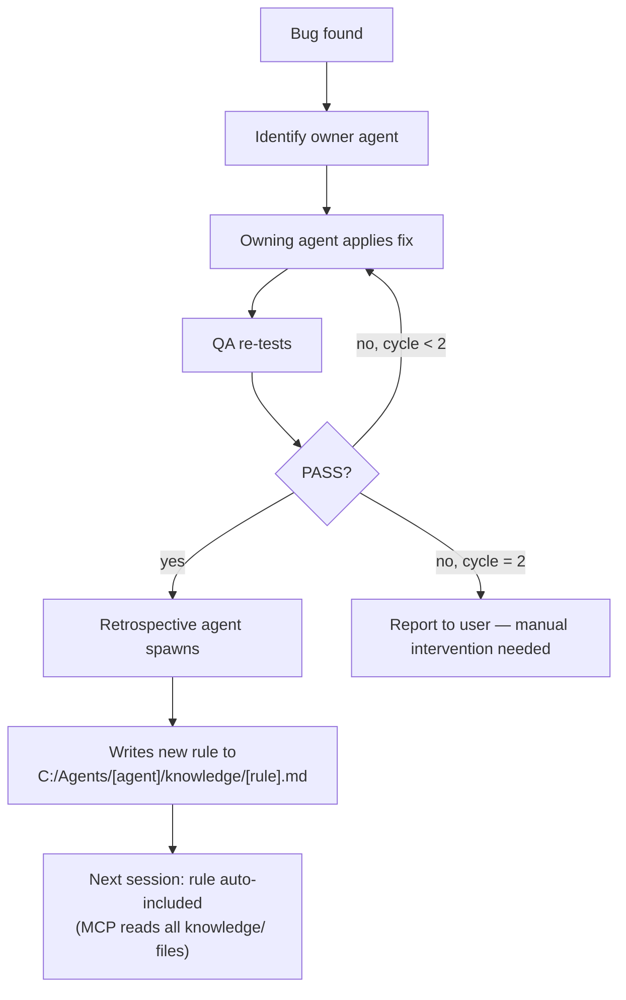

# Pipeline Deep Dive

The master agent runs a structured, gated pipeline. Every phase has a defined purpose, inputs, outputs, and ownership. Agents cannot be skipped.

---

## Pipeline Overview

```
INTAKE → ARCHITECTURE → [RESEARCH] → PLANNING → VALIDATION → IMPLEMENTATION → DRIFT CHECK → QA → [BUG LOOP] → DOCUMENTATION → VERIFICATION → SUMMARY
```

---

## Phase-by-Phase

### Phase 1 — Intake (master)

**Purpose:** Understand the task, identify disciplines, start tracking.

**Actions:**
- Detect if message describes a bug → run retrospective first
- Check MCP availability (rich mode vs fallback)
- Write `task.md` (verbatim task)
- Write `requirements.md` (which disciplines are needed)
- Generate `$sessionId` (UUID)
- Create session in cost DB (status=partial)
- Announce session on dashboard

**Output:** `task.md`, `requirements.md`, DB session row

---

### Phase 2 — Architecture Gate (architect) — MANDATORY

**Purpose:** Make all architectural decisions before any planning begins. Produce an ADR.

**Inputs:** `task.md`, `requirements.md`
**Outputs:** `agent-output/architect.md` (working notes) + `agent-output/ADR.md` (permanent record)

**Special case:** If output contains `BLOCKED_MAJOR_ARCHITECTURE_DECISION`, master surfaces both options to the user and re-spawns with the decision.

```
[GATE 0 — Architecture Approval]
Master presents: architectural approach + trade-offs + ADR decisions
User must explicitly approve before planning begins.
```

---

### Phase 3 — Research (researcher) — CONDITIONAL

**Purpose:** Investigate unknowns identified in requirements.md.

**When spawned:** Only if `requirements.md` flags unknowns or library decisions.
**Prerequisite:** `agent-output/architect.md` must exist first (researcher reads it).

**Outputs:** `agent-output/researcher.md`

---

### Phase 4 — Planning (backend + frontend + ux) — CONDITIONAL, PARALLEL

**Purpose:** Each discipline produces a detailed implementation plan. No code written yet.

**Parallelism:** Backend and frontend plan simultaneously (they write to separate files).

**Each agent produces:**
- `agent-output/[name]-plan.md` — implementation plan
- `agent-output/API.md` (backend) — permanent API reference
- `agent-output/COMPONENTS.md` (frontend) — permanent component docs
- `agent-output/ux-plan.md` (ux) — UX spec with WCAG + token references

---

### Phase 5 — Plan Validation (validator) — MANDATORY

**Purpose:** Independent review of all plans before implementation. Hard gate.

**Mode:** `PLAN_REVIEW`
**Inputs:** All `agent-output/*-plan.md` + `architect.md`
**Output:** `agent-output/validator.md` with `STATUS: PASS | APPROVED_WITH_NOTES | FAIL`

```
[GATE 1 — Plan Approval]
Master presents: what each agent plans to build + validator findings
User must explicitly approve. Implementation CANNOT start without PASS or APPROVED_WITH_NOTES.
```

**On FAIL:** Master re-spawns the failing agents with specific findings. Max 2 retry cycles.

---

### Phase 6 — Implementation (backend → frontend → ux) — CONDITIONAL, SEQUENTIAL

**Purpose:** Build the actual code. Sequential to prevent file collisions.

**Order:** Backend first (frontend depends on API shape) → Frontend → UX (if needed)

**Each agent produces:**
- `agent-output/[name]-impl.md` — implementation notes + deviations
- Evidence files: test results (backend), compiled output (frontend)

---

### Phase 6.5 — Drift Review (validator) — MANDATORY

**Purpose:** Verify implementation matches approved plans. Catch scope creep and shortcuts.

**Mode:** `DRIFT_REVIEW`
**Inputs:** All `*-plan.md` (approved baseline) vs all `*-impl.md` (what was built)
**Output:** `agent-output/validator-post-impl.md`

```
[GATE 2 — Drift Approval]
Master presents: drift findings + severity
User approves before QA starts.
```

---

### Phase 7 — QA (qa) — MANDATORY

**Purpose:** Black-box E2E testing from the user's perspective. Browser tests only.

**Always includes:**
- Auth integration test (login form → Bearer token → API returns 200)
- Visual quality check (page is not unstyled)
- Timezone test if datetime inputs are present

**Output:** `agent-output/QA-REPORT.md` + `evidence/*.webm` (videos) + `evidence/*.png` (screenshots)

```
[GATE 3 — QA Approval]
Master presents: test results + bugs found (with owner) + evidence
User approves before documentation.
```

---

### Phase 7.5 — Bug Resolution Loop — CONDITIONAL

**Purpose:** Fix bugs found by QA without re-doing the full pipeline.

**Triggered when:** `QA-REPORT.md` has `STATUS: FAIL`

**Flow:**
```
For each bug in QA-REPORT.md:
  1. Identify owner (backend / frontend / ux)
  2. Spawn owning agent with Mode: FIX
  3. Agent applies fix
After all bugs fixed:
  4. Re-spawn qa for full re-test
  5. If PASS → continue
  6. If still FAIL → retry (max 2 cycles total)
  7. If still FAIL after 2 cycles → report to user and stop
```

**After QA passes:** Spawn retrospective agent to write lessons to `C:\Agents\[agent]\knowledge\`

---

### Phase 8 — Documentation (documentation) — MANDATORY

**Purpose:** Synthesise all agent outputs into developer-facing docs.

**Hard gate:** Requires `QA-REPORT.md` with `STATUS: PASS`. Writes `BLOCKED` and stops if missing.

**Reads:** `ADR.md` + `API.md` + `COMPONENTS.md` + `QA-REPORT.md`
**Writes:** `agent-output/README.md` + `agent-output/CHANGELOG.md`

---

### Phase 8.5 — Mandatory Output Verification (master)

**Purpose:** Ensure no mandatory agent was silently skipped.

**Checks:**
- `agent-output/architect.md` exists?
- `agent-output/validator.md` exists?
- `agent-output/validator-post-impl.md` exists?
- `agent-output/QA-REPORT.md` exists?
- `agent-output/README.md` or `documentation.md` exists?

**On missing file:** Re-spawn the missing agent immediately. Never proceed with gaps.

---

### Phase 9 — Summary & Cost (master)

**Purpose:** Close the session, record costs, produce final summary.

**Actions:**
- Write `session-summary.md` with decisions, validation results, QA results
- Log all agent runs to cost DB (model, tokens, cost per agent)
- Close session in cost DB (status=completed)
- Update dashboard (session-end)

**Cost DB path:** `C:\Agents\system\cost-tracker\database\agent-costs.db`
**Report:** `& "C:\Agents\system\cost-tracker\scripts\cost-report.ps1"`

---

## The Autonomous Learning Loop

When QA finds a bug (Phase 7.5) or the user reports a production bug (Phase 1 intake):



---

## Mandatory vs Conditional Agents

```
MANDATORY (always run, every session):
  ┌─────────────┐  ┌─────────────────┐  ┌─────────────────┐  ┌────────┐  ┌───────────────┐
  │  architect  │→ │ validator (plan) │→ │ validator(drift) │→ │   qa   │→ │ documentation │
  └─────────────┘  └─────────────────┘  └─────────────────┘  └────────┘  └───────────────┘

CONDITIONAL (master decides based on requirements.md):
  ┌────────────┐  ┌────────┐  ┌──────────┐  ┌──────────┐
  │ researcher │  │   ux   │  │ backend  │  │ frontend │
  └────────────┘  └────────┘  └──────────┘  └──────────┘
  Only when unknowns  Only for   Only for     Only for
  exist               UI work    API/DB work  UI work
```

---

## Gate Protocol

Every gate follows the same pattern:

```
master reads output file
master presents summary to user:
  - what was decided/built/tested
  - any concerns or findings
master asks: "Approve to proceed to [next phase], or provide corrections."
HALT: master does not proceed until user explicitly says to continue
```

Gates exist at: Architecture (0) → Plans (1) → Implementation (2) → QA (3)
