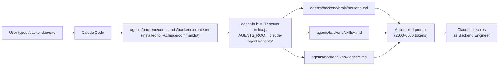
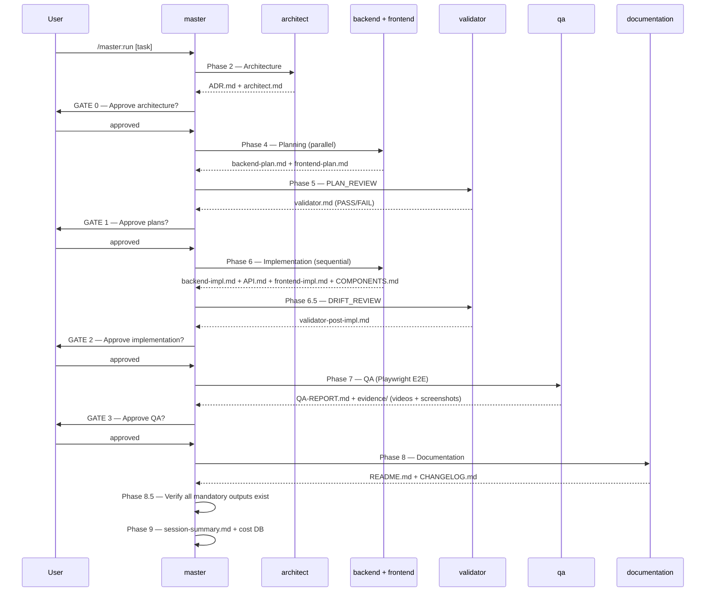

# claude-agents — Multi-Agent Engineering System

A local, self-improving multi-agent AI engineering team. Each agent is a specialist with its own domain knowledge, skills, and persona. The **master** agent orchestrates the full pipeline; specialist agents do the actual work.

---

## Quick Start

### Run the full pipeline on a task
```
/master:run Build a cancellation feature for the RoomBooking API
```

### Use a specialist agent directly
```
/backend:auditor  C:\TesteComPRD\api\RoomBooking.Api\Controllers\BookingsController.cs
/architect:create Add email notifications to the booking system
/forge:audit      ux
```

### Start the Agent Command Center (dashboard)
```powershell
& "$env:CLAUDE_AGENTS_REPO\system\agentDashboard\start.ps1"
# Opens http://localhost:4300 — see agents appear as 2D characters in real-time
```

### Check system health
```powershell
& "$env:CLAUDE_AGENTS_REPO\system\health-check.ps1"
```

---

## Architecture

```
~/.claude/agents/         ← thin Claude Code wrappers (frontmatter + identity)
agents/                ← rich agent home (persona + skills + knowledge)
C:\claude-agents\system\  ← infrastructure (dashboard, cost tracking, health check)
~/.claude/commands/       ← slash commands (/architect:create, /backend:auditor, ...)
~/.claude/mcp/agent-hub/  ← MCP server that assembles prompts from agents/
```

### How it works



---

## The Pipeline

When you run `/master:run`, master coordinates all agents in sequence:



**Mandatory agents** (never skip): architect, validator×2, qa, documentation
**Conditional agents** (based on task): researcher, ux, backend, frontend

---

## Agent Roster

| Agent | Role | Model | Est. Cost/run |
|-------|------|-------|---------------|
| [master](master/README.md) | Orchestrator | Sonnet | N/A |
| [architect](architect/README.md) | Architecture & ADRs | Opus | ~$0.27 |
| [backend](backend/README.md) | APIs, services, DB, tests | Sonnet | ~$0.24 (plan) + ~$0.35 (impl) |
| [frontend](frontend/README.md) | Angular/React/Vue components | Sonnet | ~$0.21 (plan) + ~$0.30 (impl) |
| [qa](qa/README.md) | Playwright E2E tests + evidence | Sonnet | ~$0.15 |
| [validator](validator/README.md) | Plan review + drift review | Opus | ~$0.30 ×2 |
| [ux](ux/README.md) | UX spec + accessibility | Sonnet | ~$0.10 |
| [researcher](researcher/README.md) | Research + library comparison | Sonnet | ~$0.12 |
| [documentation](documentation/README.md) | Synthesise docs | Sonnet | ~$0.08 |
| [forge](forge/README.md) | Audit + improve other agents | Sonnet | ~$0.10 |
| [system](system/README.md) | Infrastructure (not an agent) | — | — |

---

## Commands

All commands available as `/namespace:command` in Claude Code.
See [COMMANDS.md](COMMANDS.md) for the complete reference.

```
/master:run              Full pipeline on any task
/master:quick            Lightweight pipeline for simple single-discipline tasks
/master:retrospective    Teach agents from a production bug

/architect:create        Full lifecycle — architecture to review
/architect:auditor       Security, performance or pattern audit
/architect:docs          Sync docs with codebase

/backend:create          Build API endpoints, services, DB
/backend:auditor         Audit backend for security/quality
/backend:docs            Generate API documentation

/frontend:create         Build Angular/React components
/frontend:auditor        Audit for XSS, performance, a11y
/frontend:docs           Document components and state

/researcher:investigate  Phase 0 — scope research topic
/researcher:report       Execute full research with citations

/qa:test                 Write + run Playwright E2E tests

/validator:review        PLAN_REVIEW or DRIFT_REVIEW

/ux:design               User journey + WCAG spec + tokens
/ux:audit                Accessibility audit (WCAG 2.1 AA)

/documentation:write     Synthesise ADR + API + COMPONENTS + QA into README

/forge:audit             Audit an agent definition (0-6 score)
/forge:improve           Apply approved improvements to an agent
```

---

## Self-Improving System

When a bug slips past QA and reaches production, the system learns automatically:

```
User reports bug → master detects bug keywords
    ↓
retrospective agent spawns
    ↓
Identifies which agent missed it → writes new rule to
agents/[agent]\knowledge\[descriptive-name].md
    ↓
Next time that agent runs → rule is automatically included
(MCP reads ALL files from knowledge\ on every prompt assembly)
```

---

## Documentation Index

| File | Purpose |
|------|---------|
| [README.md](README.md) | This file — overview and quick start |
| [AGENTS.md](AGENTS.md) | Full agent catalog (all 15 fields per agent) |
| [COMMANDS.md](COMMANDS.md) | Complete command reference with examples |
| [PIPELINE.md](PIPELINE.md) | Pipeline deep-dive with diagrams |
| [CONTRIBUTING.md](CONTRIBUTING.md) | How to add agents, commands, knowledge |
| [system/README.md](system/README.md) | Infrastructure, cost tracking, dashboard |

---

## Directory Structure

```
agents/
├── README.md               ← you are here
├── AGENTS.md               ← full agent catalog
├── COMMANDS.md             ← slash command reference
├── PIPELINE.md             ← pipeline deep-dive
├── CONTRIBUTING.md         ← how to extend the system
│
├── architect\              ← architect agent
│   ├── brain\persona.md    ← identity + values
│   ├── knowledge\          ← architectural patterns, security, stacks
│   ├── skills\             ← execution protocols, ADR format
│   └── commands\           ← TOML command definitions
│
├── backend\                ← same structure
├── frontend\               ← same structure
├── qa\                     ← qa agent
│   ├── brain\persona.md
│   ├── knowledge\          ← playwright patterns, coverage heuristics, visual quality
│   └── skills\             ← evidence collection, test patterns
│
├── validator\              ← validator agent
│   ├── brain\persona.md
│   └── knowledge\          ← SOLID principles, security checklist, review patterns
│
├── ux\                     ← ux agent
│   ├── brain\persona.md
│   └── knowledge\          ← WCAG 2.1 AA, design token patterns
│
├── forge\                  ← meta-agent (audits other agents)
│   ├── brain\persona.md
│   ├── knowledge\          ← agent standards
│   ├── skills\             ← audit protocol
│   └── audits\             ← generated audit reports
│
├── researcher\             ← researcher agent
├── documentation\          ← documentation agent
└── master\                 ← master agent

C:\claude-agents\system\    ← infrastructure (not an agent, sibling of agents\)
    ├── agentDashboard\     ← real-time visual dashboard (Angular + C#)
    ├── cost-tracker\       ← SQLite cost tracking
    │   ├── database\
    │   └── scripts\
    └── health-check.ps1    ← system health verification
```
